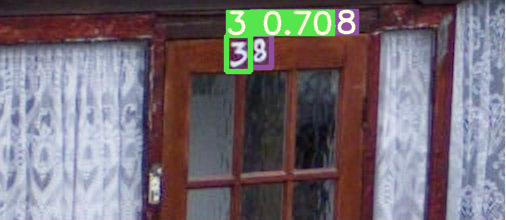
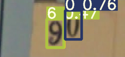
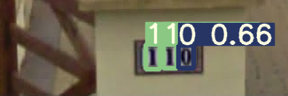

# SVNN Object Detection Using YOLOV5

## Process the SVHN dataset

1. Go to org_dataset folder. Download the SVHN format one dataset from http://ufldl.stanford.edu/housenumbers/
2. extract the folders inside org_dataset. example command `tar xvzf extra.tar.gz`
3. run  `python create_annotations_from_matobj.py --mode extra`
4. create_annotations_from_matobj.py should be executed with mode train/test/extra
5. create_annotations_from_matobj.py will convert the .mat format to dict format and save it in the current dir
6. run `python combine_dataset.py ` to combine train and extra images to create a bigger dataset. This will create a new annotations file as well as a folder named combined with all the images
7. check out the directory structure image attached to understand
    
## Create Yolo Annotations
1. Go to yolo_exp folder. Download the SVHN format one dataset from 
2. Run `python create_yolo_annotations.py --mode combined ` and `python create_yolo_annotations.py --mode train `
3. This will create 2 folders **svhn2020combined** and **svhn2020train** in the same dir of yolo_exp 

## Train Yolov5

1. Clone and install req from https://github.com/ultralytics/yolov5 inside the yolo_exp folder
2. Check out https://github.com/ultralytics/yolov5/wiki/Train-Custom-Data 
3. We have already created the dataset folder **svhn2020combined** and **svhn2020train**
4. Copy the yaml files from **./yolo_exp/training_yaml_files to  ./yolo_exp/yolov5/data**
5. I have initially trained the network with the default aumentation strategy. Even though this was working fine for normal images but i wanted to use random rotation, because some of my test images were inverted. 
6. So i changed the value of **degrees** to 180 in **./yolov5_exp/yolov5/data/hyp.scratch.yaml**
7. train command to run from **./yolov5_exp/yolov5/** folder 
8. `python train.py --batch 32 --weights yolov5m.pt  --data ./data/svhn2020combined.yaml --img 320 --epochs 50 --name test_combined`  
`python train.py --batch 32 --weights yolov5m.pt  --data ./data/svhn2020train.yaml --img 320 --epochs 50 --name test_train`
9. training will be saved inside **./yolov5_exp/yolov5/runs/detect**

## Inference

1. run the command below from  **./yolov5_exp/yolov5/** folder. check out inference inside **./yolov5_exp/yolov5/runs/detect** 
`python detect.py --source /home/deep/Pictures/test_final --weights ./runs/train/test_combined/weights/best.pt --conf 0.25 --save-txt --save-conf`

## Weights Download Link
Download models from the google drive https://drive.google.com/file/d/1Ez_Y_Uolf2cpndB6e40erdDUAHqNVO_S/view?usp=sharing

## Results

## TODO
 - [x] Add trained weights 
 - [x] Add sample outputs

## Reference  
1. YOLOv5 repo https://github.com/ultralytics/yolov5
